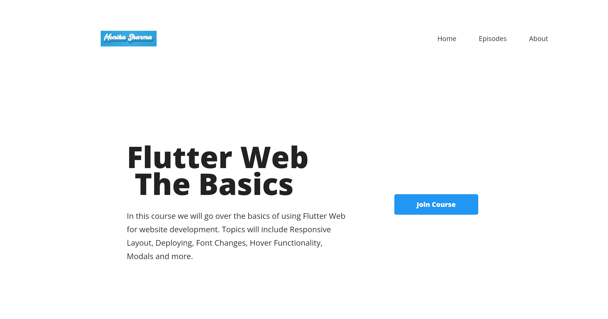
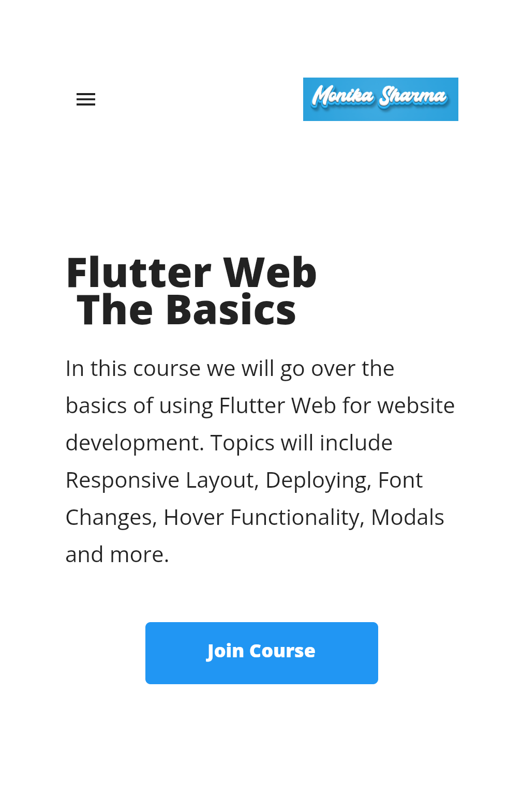

Flutter
Build Status - Cirrus Discord badge Twitter handle codecov CII Best Practices OpenSSF Scorecard

Flutter is Google's SDK for crafting beautiful, fast user experiences for mobile, web, and desktop from a single codebase. Flutter works with existing code, is used by developers and organizations around the world, and is free and open source.

Documentation
Install Flutter
Flutter documentation
Development wiki
Contributing to Flutter
For announcements about new releases, follow the flutter-announce@googlegroups.com mailing list. Our documentation also tracks breaking changes across releases.

Terms of service
The Flutter tool may occasionally download resources from Google servers. By downloading or using the Flutter SDK, you agree to the Google Terms of Service: https://policies.google.com/terms

For example, when installed from GitHub (as opposed to from a prepackaged archive), the Flutter tool will download the Dart SDK from Google servers immediately when first run, as it is used to execute the flutter tool itself. This will also occur when Flutter is upgraded (e.g. by running the flutter upgrade command).

About Flutter
We think Flutter will help you create beautiful, fast apps, with a productive, extensible and open development model, whether you're targeting iOS or Android, web, Windows, macOS, Linux or embedding it as the UI toolkit for a platform of your choice.

Web Application For Desktop/Mobile Developed in flutter

Library used 
1. get_it
2. Responsive_builder# flutterweb
# flutterweb
# flutterweb
